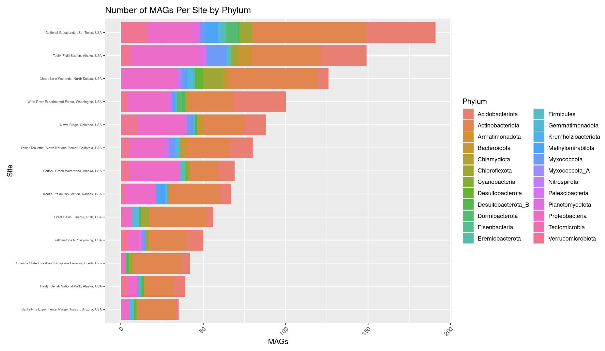

The Wind River Experimental Forest is a field site about 40 miles NE of Vancouver, WA in the Gifford Pinchot National Forest. This is in Neon's Pacific Northwest Domain (D16). The area is populated by douglas firs and western hemlocks of diverse ages. The region's climate is temperate with an average temperature of 9.2°C and average precipitation of 87.6 in. In the valley of volcanoes, Mt. Rainier and Mt. St. Helens, the soil here is comprised of volcanic ashe, pumice, basalt bedrock, and andesite (leftover from lava flows). Among the animals living in this area are elk, bobcats, cougars, black bears, various birds, and many small mammals.
After being used as a seedling nursery for post-wildfire forest rehabilitation for almost a century, the NEON site was established in 2006 and sampling for the project began in 2018. 

## An Overview of Acidobacteriota

Acidobacteriota are a diverse phylum of bacteria that can be found in many different habitats, such as soil, oceans, caves, and hot springs. Most members of this phylum are acidophilic. Despite how common they are, not much is known about acidobacteria, as they are difficult to grow in culture.
Acidobacteria are believed to play several ecological roles, such as plant-growth promoting rhizobacteria, decomposers, especially of complex carbohydrates, as well as sulfur metabolism. They are also considered keystone taxa, which are taxa that are important for the stability of the ecosystem in grasslands, forests, and agricultural soils. [@kalam_recent_2020]

## Abstract
Utilizing the coding knowledge and skills learned in Biology 476: Evolutionary Genomics and Bioinformatics, students built a github repository and Quatro website. The website includes graphs and tables created by the students that showcase data from NEON metagenomes. The results are visual representations of data from the WREF collection site in Vancouver, WA as well as data on the bacteria phylum acidobacteriota. RESULT

## Motivating Reasons
The motivating reasons behind this project were to further develop my skills in R Posit Cloud, to practice integration and manipulation of data, and to learn about acidobacteriota and the WREF site. I took Biology 478: Human Genome Analysis in the fall of 2023 and this gave me some foundational skills for working with data in R. Through my engagement with this project, I have learned more about data wrangling, ggplot, ggtrees, quatro website building, and github repositories. These will be very useful to my future career in biological research as I will be able to analyze and present data that I have collected myself for presentations and papers. The topic of this project, acidobacteriota and WREF, have given me insight into a particular bacterial phylum and its evolutionary lineage. It also shed light onto how data collection sites are chosen, managed, and utilized. 

## Methods
We used Rstudio Posit-Cloud to wrangle, organize, analyze and graphically present the NEON MAGs data for the WREF site and the phylum actinobacteria. In a quatro markdown file we inserted our code chunks that contained data which we had filtered, mutated, joined, and separated just to name a few functions utilized. To present this data we used tools like ggplot, facet wrap, geom bar, geom point, and ggtrees to create elaborate and well-formatted graphs with appropriate titles and keys. 
 
 
 
 
 
 
 
 

 

 

 

 

 

Image key:
Wref_phbacteria4 : tree showing the phylums sampled at WREF when the pH was less than 4
Wref_phbacteria7 : tree showing phylums found at WREF when ph less than 7
Wref_phacido4_class: tree showing acidobacteria found at ph less than 4 by class
Wref_phacido4_order: tree showing acidobacteria found at ph less than 4 by order

